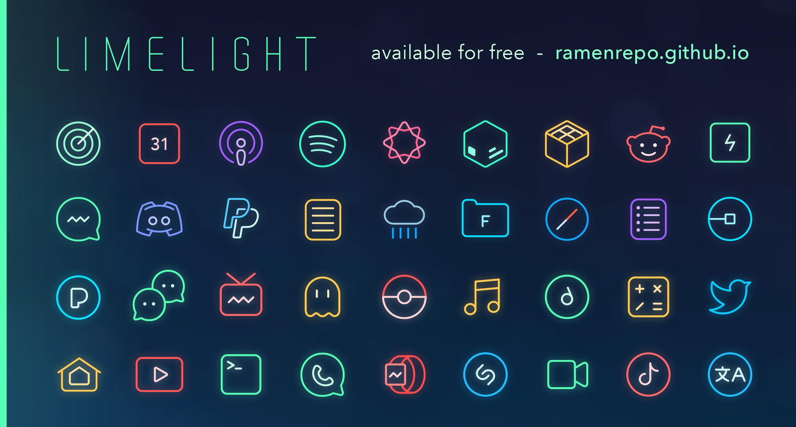

# Limelight

- This repository contains the source vectors for Limelight (.ai and .svg)
- I have included a CSV file which includes the names and bundle IDs of icons in roughly the same order as the icons are placed in the vector files (a,b,c,d,e).

## Exporting
- I usually choose to export as a PNG with Photoshop.
- Naming convention is '[bundleid]-large.png'
- You can find bundle IDs here: https://offcornerdev.com/bundleid.html
- You can alternatively install BundleIDsXI or some equivalent to list the bundle IDs of apps installed on your device.
- More details: https://github.com/AnemoneTeam/Anemone/wiki

## Proportions
- Relative to 900x900px canvas:
- 26px line width
- 40px Gaussian blur for glow

## Exporting Icons Without Glow:
- Copy vector into 900x900px canvas
- Export as PNG with 'Smallest / Slow' compression

## Exporting Icons With Glow:
- Copy vector into 900x900px canvas
- Make a duplicate of the vector on another layer
- Apply 40px Gaussian Blur to the duplicate, leaving the original intact
- Optionally, scale down icons to 180x180px to reduce file size
- Export as PNG with 'Smallest / Slow' compression

## Automation
- When making Limelight I only created a folder with the colored non-glowing icons.
- I used Photoshop 'Actions' to automate the glow effect on the entire folder
- Same process for making all icons white
